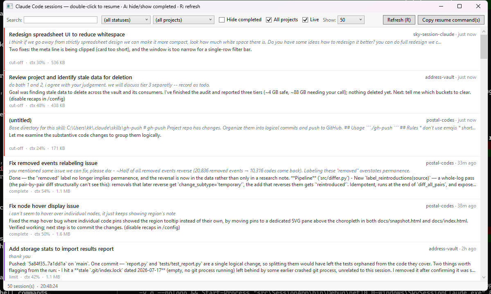

# Sky Session Claude

A tiny Windows desktop app that shows all your **Claude Code sessions** in one place and lets you jump back into any of them with a double-click.

Claude Code stores every session as a transcript under `~/.claude/projects`. Once you have dozens of them across several repos, finding the one you want — *"which session was I in when I asked it to fix the migration?"* — turns into archaeology. This app scans those transcripts and lays them out in a sortable, filterable grid so you can see at a glance what each session was doing, whether it finished, and how full its context got.



## What it shows

Each row is one session:

| Column | Meaning |
|---|---|
| **Last active** | When the transcript was last written to |
| **Name / Project** | Session id and the repo it belongs to |
| **Status** | `complete`, `waiting-you`, `waiting-agent`, `cut-off`, `limit`, `error`, `interrupted` |
| **Ctx%** | How full the context window is (auto-detects 1M-token sessions) |
| **Last prompt** | Your most recent message in that session |
| **Agent recap** | A short summary of what the agent last did |
| **KB** | Transcript size on disk |

Unfinished sessions are tinted amber so your eye lands on the ones still waiting on you. ("Unfinished" = every Status except `complete`.)

## How Status is decided

Status is read from the **last real turn** — the final meaningful record in the session file, after skipping attachment/snapshot noise. The vocabulary below is used throughout the code and docs; the full list lives in [`docs/GLOSSARY.md`](docs/GLOSSARY.md).

- **Operator** — you, the human who types prompts. **Agent** — Claude, doing the work. (These stay distinct from the raw JSON `user`/`assistant` roles, which are more overloaded than they look.)
- A `user`-role record is one of three **turns**: an **operator turn** (you typed text), a **tool-result turn** (a `tool_result` came back), or a **harness turn** (tooling injected it — `<system-reminder>`, `/clear`, `<task-notification>`).
- A **close-out** is a terminal operator turn that thanks rather than asks ("thank you", "all good"). It reads as done — though usually the agent has already replied, so the session is `complete` regardless.

So: last real turn is an agent turn → `complete` (or `waiting-you` if it ends in a question); an operator/harness turn → `waiting-agent`; a stalled tool step → `cut-off`; an error/limit record → `error`/`limit`.

## What it does

- **Double-click a row** → opens a new PowerShell terminal in that repo and runs `claude --resume <id>`, dropping you straight back into the session.
- **Copy resume command(s)** → copies the resume command for every selected row to the clipboard.
- **Live updates** → a filesystem watcher refreshes rows automatically as sessions change (toggle off with the **Live** checkbox).
- **Filter** by search text, status, or project; hide completed sessions; scope to the current project or all projects; cap how many sessions load (50 → All).

### Keyboard shortcuts

- **R** — refresh
- **A** — hide/show completed sessions

## Install

1. Download **`SkySessionClaude.exe`** from the [latest release](https://github.com/skfd/sky-session-claude/releases/latest).
2. Run it. That's it — it's a single self-contained file, no .NET runtime or installer required.

Windows SmartScreen may warn about an unrecognized app the first time (the binary is unsigned). Click **More info → Run anyway**.

## Build from source

Requires the [.NET 10 SDK](https://dotnet.microsoft.com/download).

```powershell
# Run in-place
dotnet run --project src/SessionApp

# Or produce the release single-file exe in dist/
./publish.ps1
```

## Project layout

- **`src/SessionCore`** — session scanning, transcript parsing, status detection, live-refresh cache/watcher (no UI dependencies).
- **`src/SessionApp`** — the WPF grid and view model.
- **`src/SessionCore.Tests`** — unit tests for the core.
- **`get-claudesessions.ps1`** — the original PowerShell script this app is a faithful port of; still handy for `-Json` output consumed by other tools.

## License

MIT
