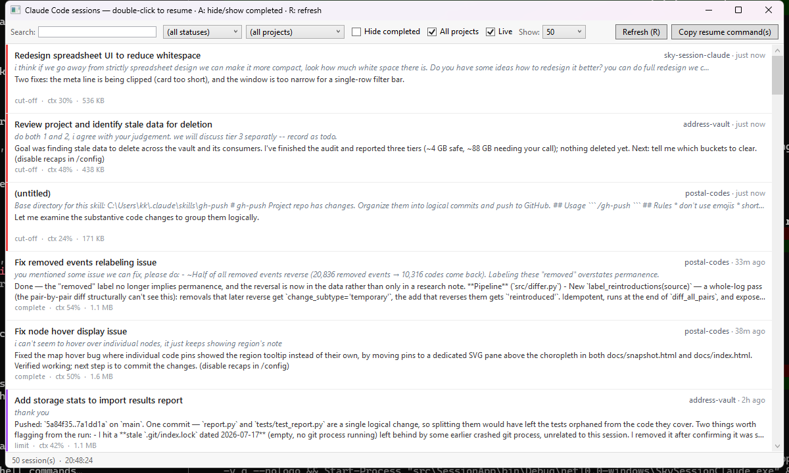
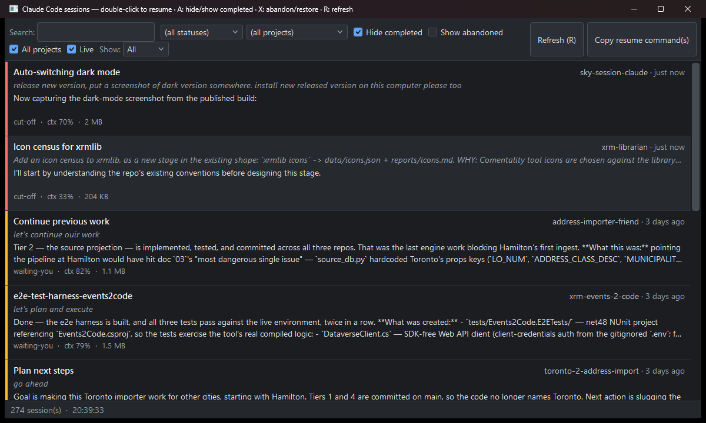

#  Sky Session Claude

A tiny Windows desktop app that shows all your **Claude Code sessions** in one place and lets you jump back into any of them with a double-click.

Claude Code stores every session as a session file (a `.jsonl`) under `~/.claude/projects`. Once you have dozens of them across several repos, finding the one you want — *"which session was I in when I asked it to fix the migration?"* — turns into archaeology. This app scans those session files and lays them out as a filterable list of cards so you can see at a glance what each session was doing, whether it finished, and how full its context got.



It follows the Windows apps theme, so the same list in dark mode:



## What it shows

Each card is one session, four lines tall:

| Line | Meaning |
|---|---|
| **Title** | Session name, plus the repo it belongs to and how long ago it was last worked on |
| **Prompt** *(italic)* | Your most recent message in that session |
| **Recap** | A short summary of what the agent last did, clipped to two lines (hover for the rest) |
| **Meta** | `complete`, `waiting-you`, `waiting-agent`, `cut-off`, `limit`, `error`, `interrupted` · how full the context window is (auto-detects 1M-token sessions) · session file size on disk · then, for a session running right now, the two things only true while it runs: **↻ 2.1.239** if it is on an older build than the one installed, and **RC** if Remote Control is connected to it |

A card whose session is **open in a terminal right now** gets a small green dot before its title. It answers the question you'd otherwise answer by alt-tabbing through terminals — *is this one already up somewhere?* — and marks exactly the cards where a double-click jumps to that window instead of starting a second `claude --resume` against the same session. The dots are polled every few seconds rather than driven by the file watcher, because closing a terminal writes to no session file and a dot left lit would send a double-click looking for a window that is gone.

A session is matched to its process by name, and updating renames the binary out from under the processes still running it — `claude.exe` becomes `claude.exe.old.<timestamp>` so the new build can take the name. Matching `claude` alone therefore lost sight of a session at the exact moment it fell behind, which is when you most want to see it: the dot went out on precisely the sessions worth restarting.

Cards are a fixed height, so one long recap can never push the rest of the list off screen. Unfinished sessions get a coloured stripe down their left edge so your eye lands on the ones still waiting on you; completed ones have none. ("Unfinished" = every Status except `complete`.)

The age is the **last real turn** in the session file, not the file's timestamp on disk. Resuming a session appends bookkeeping records (mode, titles, last prompt) the moment it opens, so a file's last-write time says "just now" even when you opened a session, looked at it, and typed nothing — which is exactly when you most want to know it has been sitting for three weeks. A fork still reads as new, though — the age is floored at the file's own creation time, so a fresh file full of copied records doesn't inherit the age of the conversation it branched from.

A session you have come back to shows both sittings: **`2 days ago → 1h ago`** — worked on two days ago, then again an hour ago. A pause of over an hour between turns is what separates one sitting from the next. Both dates are real turns, so opening a session (or answering Claude Code's restore prompt) moves neither; hover for the exact times, and for when it was last opened.

## How Status is decided

Status is read from the **last real turn** — the final meaningful record in the session file, after skipping attachment/snapshot noise. The vocabulary below is used throughout the code and docs; the full list lives in [`docs/GLOSSARY.md`](docs/GLOSSARY.md).

- **Operator** — you, the human who types prompts. **Agent** — Claude, doing the work. (These stay distinct from the raw JSON `user`/`assistant` roles, which are more overloaded than they look.)
- A `user`-role record is one of three **turns**: an **operator turn** (you typed text), a **tool-result turn** (a `tool_result` came back), or a **harness turn** (tooling injected it — `<system-reminder>`, `/clear`, `<task-notification>`).
- A **close-out** is a terminal operator turn that thanks rather than asks ("thank you", "all good"). It reads as done — though usually the agent has already replied, so the session is `complete` regardless.

So: last real turn is an agent turn → `complete` (or `waiting-you` if it ends in a question); an operator/harness turn → `waiting-agent`; a stalled tool step → `cut-off`; an error/limit record → `error`/`limit`.

## What it does

- **Double-click a card** → if that session is already open in a terminal (the ones wearing a green dot), jumps to that window; otherwise opens a new PowerShell terminal in that repo and runs `claude --resume <id>`, dropping you straight back into the session. (In Windows Terminal it lands on the exact tab: the session's console title names it, and the right window and tab are found by that name. Two sessions idling under the same title are indistinguishable, so that case settles for raising the window.)
- **Copy resume command(s)** → copies the resume command for every selected card to the clipboard.
- **Fork a session** (**F**) → branch the selected session into a new one, picking where it branches off: **at the tip** (the official `claude --resume --fork-session`) or **from just before any earlier prompt**. The from-a-point fork writes a new session file containing only the conversation up to that moment (session records form a `uuid`/`parentUuid` tree, so the app copies the chosen record's ancestry under a fresh session id) and resumes it — handy for "back to before I asked it to do X, but keep the original too". The original session is never modified; a fork you don't like is just a session file you delete. Note the record format is internal to Claude Code, so a future CLI version could change it — worst case a fork fails to resume, the original is always safe.
- **Restart a session** (**Ctrl+R**), or **Restart stale (N)** for all of them at once → Claude Code updates in place, so every session keeps the build it started with and a dozen terminals start asking to be restarted at the same moment. This does it for you, *in the terminal the session is already sitting in*: it borrows that terminal's console the same way the green dot does, asks Claude to quit, and types the resume command at the shell underneath. No window is raised and nothing is taken from whatever you are doing. A session with Remote Control connected comes back with it — `/remote-control` is per-session and dies with the process, so the resume asks for it again, and the restart is only reported done once the session says it reconnected. It also comes back under the same name: the CLI names a session from its folder plus a suffix drawn fresh at every launch and never revisits it, so a restart used to be the one thing that changed a session's name — and changed it to something no more meaningful than before. The relaunch supplies the name instead, taking it from the session's own title where it has one (*Add retry logic to address-vault download*) and falling back to the folder and the session id prefix (`address-vault-f2`) for a terminal that was opened and never used. A name you set yourself is left alone.

  The exit is Ctrl+C, not `/exit`, because of the input box: `/exit` typed into a box that already holds something you half-wrote appends to it and sends the lot as a prompt, while the first Ctrl+C throws the draft away unsent.

  **Restart stale** takes only the sessions where nothing can be lost: running an older build, idle for a while, and finished. Everything else is offered on its own card with the reason it was skipped — a turn in flight, a question waiting on you (that unsent draft exists in no file, so nothing outside the process can see it), a session running under the desktop app or the SDK where there is no terminal of ours to drive, or one stopped mid tool step. The count in the button is what it will actually restart, and what it skipped is reported rather than passed over in silence.
- **Live updates** → a filesystem watcher refreshes cards automatically as sessions change (toggle off with the **Live** checkbox).
- **Filter** by search text, status, or project; hide completed sessions; scope to the current project or all projects; cap how many sessions load (defaults to **All**, so an old unfinished session can never hide just past a cut-off; drop to 50 → 500 if you want a shorter scan).
- **Mark a session done** (**D**) → ticks off sessions whose work actually landed, whatever the file ended on. The classifier reads the last turn, so an agent that finishes and then asks "want me to push?" leaves `waiting-you`, and hitting Esc once the change is in leaves `interrupted` — both still nag from the list. **D** settles them: the card keeps its real status and gains a green tick, and it drops out of the list with the completed ones until you untick **Hide completed**.
- **Abandon a session** (**X**) → crosses out sessions you're *not* going back to. They stay honestly classified as unfinished — abandoning is your judgment, not the classifier's, so it never changes the status. Abandoned cards are hidden until you tick **Show abandoned**, which shows them struck through.
- Both marks are yours, not the scanner's; pressing the same key again clears one. They persist in `%APPDATA%\sky-session-claude\dispositions.json` (migrated from the older `abandoned.json`) and never touch `sessions.json`, which every scan regenerates. The file has more than one writer — the window on a keystroke, `SessionCli done` on an agent's behalf — so a mark is merged into whatever is on disk rather than dumped over it, and a mark made elsewhere lights up on the card within a few seconds without a refresh.
- **Live in the notification area**  → Sky sits next to the clock, and the icon is the number rather than a cloud: how many sessions are still on the hook, in the pink of the cloud it replaced — the same count the window title spells out. One colour serves both taskbars, so unlike the window icon there is no day/night pair. Hover for the exact figure (which matters past 99, where the glyph gives up and says `99+`), left-click to bring the window up or tuck it away again, right-click for **Open Sky** and **Exit**.

  Closing the window now hides it there rather than quitting: the scan, the file watcher and the three-second poll all carry on behind it, so the number by the clock stays true and coming back costs nothing. **Exit** on that menu is the way out — or `SkySessionClaude.exe --quit` from a script, which signals the instance that is up and is how `publish.ps1` frees the exe before overwriting it.

  Windows files a new tray icon into the `^` overflow the first time it sees one. Drag it out onto the taskbar once (or *Settings → Personalisation → Taskbar → Other system tray icons*) and it stays out.

- **Dark mode** → follows the Windows apps theme, title bar included, and switches live when you flip the system setting — no restart, and no in-app toggle to keep in sync. The window and taskbar icon switch too: by night the cloud gets a moon and stars .

### Keyboard shortcuts

- **R** — refresh
- **Ctrl+R** — restart the selected session(s) in place
- **A** — hide/show completed sessions
- **D** — mark the selected session(s) done (again to clear)
- **X** — abandon the selected session(s) (again to restore)
- **F** — fork the selected session (at the tip, or from before any earlier prompt)

## Install

1. Download **`SkySessionClaude.exe`** from the [latest release](https://github.com/skfd/sky-session-claude/releases/latest).
2. Run it. That's it — it's a single self-contained file, no .NET runtime or installer required.

Windows SmartScreen may warn about an unrecognized app the first time (the binary is unsigned). Click **More info → Run anyway**.

## Build from source

Requires the [.NET 10 SDK](https://dotnet.microsoft.com/download).

```powershell
# Run in-place
dotnet run --project src/SessionApp

# Produce the release single-file exe in dist/ AND refresh the stable install
# under %LOCALAPPDATA%\Programs\SkySessionClaude (what the Start-menu shortcut runs)
./publish.ps1

# Just build dist/, leave the installed app alone
./publish.ps1 -SkipInstall
```

## Headless mode

Everything the window does, **`SessionCli.exe`** does from a command line — no window, no UI, output as JSON. It shares `SessionCore` with the app, so the two agree on how a session's status is classified, when a restart is safe, and where your marks live; there is no second implementation of any of it to drift.

That covers two rather different callers. Some tools (like the morning brief) run in a sandbox that can't read `~/.claude/projects` directly, and just want the list: a scheduled task on the host runs `SessionCli.exe --json <path>` to refresh a file the sandbox can then read — see `schedule-add.ps1` — and `inbox` carries what the brief decided back the other way. And an agent sitting in one session can look at all the others, and act on them.

```powershell
# Reading
SessionCli                          # every session as JSON (same as `list`)
SessionCli list --unfinished        # drop everything settled — the useful default
SessionCli list --status waiting-you --project foo --search migration
SessionCli list --live              # open in a terminal right now
SessionCli list --stale             # live, but behind the installed build
SessionCli show <id>                # one session in full, with its fork points
SessionCli live                     # what's running, straight from the registry
SessionCli peek <id>                # what a live session's terminal shows right now

# Marking — yours, not the classifier's; the app picks these up within seconds
SessionCli done <id>...             # and undone, abandon, restore

# Acting
SessionCli fork <id> --at-prompt 3  # writes the branch; no terminal, original untouched
SessionCli fork <id> --tip          # the official --fork-session, in a new terminal
SessionCli restart <id>...          # restart in the terminal it already sits in
SessionCli restart --stale          # prints the plan; add --yes to actually do it
SessionCli close <id>...            # quit it, and close the terminal it sat in
SessionCli close --finished         # end of day; prints the plan, add --yes to do it
SessionCli resume <id>              # open a terminal and resume
SessionCli resume <id> --force      # end whatever holds it, then resume
SessionCli new --in <path> --trust  # start one, and take its trust prompt for you
SessionCli standby                  # a phone-reachable session per recent project
SessionCli trust <id>               # answer the trust prompt a session is sitting on
SessionCli inbox --run <path>       # run what the morning brief queued in a file
```

`resume` refuses when a session is already open, and it is right to: two `--resume`s of one conversation are two processes writing one file. But that check reads the registry, and the registry only holds sessions that got far enough to write an entry — a CLI that starts and then hangs holds a terminal nothing in the registry knows about. Every verb then calls it "not open in a terminal", and the session is stranded with no way back through the tool that stranded it.

So the holder is looked up by command line as well: a resumed session carries `--resume <id>` from the moment the process exists, whether or not startup ever finishes. `resume` says which of the two found it — *already open in a terminal (pid 36988)* versus *running (pid 51380) but never registered — it may be stuck starting up* — and `--force` ends the holder and resumes in the terminal it vacated. Unlike `restart` it does not ask Claude to quit first: a hung process is precisely the one that will not answer a Ctrl+C. The conversation is on disk either way, so a kill costs only what lived in the process — a turn in flight, an unsent draft — which is why it takes `--force` to say so.

`peek` reads a live session's screen — the visible window of its console, borrowed the same way a restart borrows it, with nothing focused and nothing typed. It answers the question the session file cannot: a terminal blocked on Claude Code's "do you trust this folder?", a permission it is waiting to be granted, a draft sitting in its input box — none of that is written anywhere until it is answered. It resolves ids against the live registry rather than the projects folder, so a session that has been opened but not yet typed into (which has no file at all) can still be looked at.

`close` is the end of the workday: it asks a session to quit, then types `exit` at the shell underneath so the tab goes too rather than leaving you an empty prompt per session (`--keep-terminal` stops at the session). It asks the same question a restart does — nothing in flight, nothing half-typed, no approval pending — and then the one a restart never has to. A restart puts the session back; a close takes it away, and an open terminal is how unfinished work announces itself in the morning. So `--finished` sweeps only what it can prove is over: the file ended complete, or you ticked it off, or nobody ever typed into it. Idle-but-unfinished — an error, a rate limit, a question you never answered — is reported with the reason and left where it is. Your own mark outranks the classifier, since `done` and `abandoned` both mean you are not coming back; it never outranks the process, so a busy session stays put whatever you marked it. Like `peek`, `close <id>` resolves ids against the live registry, so a terminal opened this morning and never used — which has no file at all — is something you can name and close.

`trust` answers Claude Code's "do you trust the files in this folder?" — the dialog a session stops on before it will start in a folder Claude Code has not seen. It is the only verb that types an answer into a conversation rather than at the shell around it, so it is the narrowest one here: it presses Enter, on that one dialog, and only when it can see the dialog with "Yes, I trust this folder" selected. That check is the point rather than politeness — the second option is "No, exit", so the same keystroke on a screen where the selection has moved closes the session instead of trusting the folder. Anything it will not answer comes back with the screen and nothing typed. `new --in <path> --trust` does the same for a session it just started: it waits up to 30s for that dialog to appear naming that folder, takes it, and reports the session past it, so a launch into a fresh repo comes up ready to work.

`new` is the one verb that names no session, because the id it would name does not exist until the CLI writes its first record. It opens a terminal in a folder at a fresh `claude` prompt — `--in` defaults to the folder you are in, `--name` to whatever the CLI derives — and the session joins `list` under its own id once you have typed something into it.

`standby` is the verb for walking away from the desk. Remote Control is per session and per process, so a project with nothing running is a project your phone cannot open — and there is no way to start one *from* the phone either. That asymmetry is the whole reason this verb exists: everything else here can wait until you are back, and this one has to happen before you leave. It reads recency off the transcripts and opens one fresh `claude --remote-control` per project you have worked in lately, so the phone shows a list of your repos instead of an empty one.

Fresh sessions, not resumed ones. A resumed conversation comes back with its context window where it left it and its last question still hanging, and what gets asked from a phone is nearly always a new thing about a familiar repo. Reaching a *particular* conversation is still `resume <id> --rc`, and a single folder is `new --in <path> --rc`.

Like the other sweeps it prints its plan and does nothing until `--yes` — not because anything is at risk (every session it touches is one it just made) but because the plan is also the count of terminals about to appear on your desktop. `--since` sets how far back "lately" reaches, written the way you say it (`7d`, `12h`, `90m`; a week by default), and `--recent <n>` caps how many come up. A repo already answering the phone is reported rather than doubled up, since two standby sessions in one repo are two identical rows in a list that shows no folders. A repo that has since been deleted is reported rather than `cd`-ed into, because a shell that cannot reach a folder stays where it started and the session would come up on your phone claiming to be somewhere it is not. And the worktrees an agent makes under a repo's `.claude` are not projects at all: they are the newest folders on disk at exactly the moment they stop being folders.

`SessionCli help` prints the lot, including the `list` filters (`--disposition`, `--limit`, `--top`, `--newest-per-project`, `--context-window`, `--json <path>`).

A session id can be shortened to any unique prefix, like a short commit sha — resolved by a directory walk, so acting on one named session never pays for a scan of all of them. Every verb answers with the same `{ Ok, Action, Message, Items }` envelope and sets an exit code to match, and every acting verb takes `--dry-run`.

Two things these verbs will not do without being told twice, because they drive real terminals:

- **`restart --stale` and `close --finished` state their plan and stop.** They only act on `--yes`. Each sweep takes only the sessions where nothing can be lost — provably idle, and either stale or over — and reports each one it left with the reason, exactly as the button does.
- **Nothing touches the session the command is running inside** without `--force`. An agent restarting its own session kills itself mid-sentence.

Ctx% switches to a 1M budget for sessions detected on the extended context window: either a turn exceeded 200k tokens, or the session ran on the model configured with the `[1m]` suffix in `~/.claude/settings.json` (transcripts don't record the window themselves).

The pre-verb command line still works exactly as it did — `SessionCli --json <path> --top 50` emits the same fields in the same order, with the new ones (`Disposition`, `Settled`, `Live`) appended where no reader of named fields will notice.

### The brief's inbox

The scheduled task that writes `sessions.json` gave the morning brief a way to *read* your sessions, and nothing else. Whatever you decided at 7am — resume that one, tick this one off, it's dead, drop it — you carried back to the machine yourself and re-typed. `inbox` is that channel's return path: the brief writes a `commands.json` into the same folder it reads `sessions.json` from, and a scheduled task on the host runs `SessionCli inbox --run <path>` to carry it out. `schedule-add.ps1` registers both halves — the daily scan out, and the inbox back every five minutes, running interactively because the whole point is a terminal you can see.

The point of using the folder rather than a port is that there is nothing to defend. No listener, no token, no firewall rule, and nothing a web page you happen to be browsing can reach — the only writers are the sandbox that already has the folder mounted and processes already running on this machine. It also means the brief can be read anywhere, including on a phone that has no way to reach this machine at all: the decisions ride back in a file and land when the task next fires.

```json
{
  "issuedAt": "2026-08-23T07:12:00+01:00",
  "source": "dispatch",
  "commands": [
    { "action": "resume",  "id": "abc1234" },
    { "action": "done",    "id": "def5678" },
    { "action": "abandon", "id": "9f0e1a2" },
    { "action": "new",     "in": "C:\\Users\\kk\\Code\\address-vault" }
  ]
}
```

The file is written by an agent in one shot, with no chance to see an error and correct it before tomorrow, so the parser is forgiving about spelling — `action`/`verb`/`do`, `id`/`session`/`sessionId`, `in`/`folder`/`path`/`cwd`, an array with no wrapper — and unforgiving about everything that decides what runs. Guessing a field name wrong should cost a re-read; guessing an action wrong would cost someone's terminal.

Three rules follow from the caller not being in the room:

- **Nothing runs twice.** The queue is moved to `commands.last.json` *before* the results are written to `commands-result.json`, so a task firing every minute finds an empty inbox on the second minute. A missing file is success, not an error — the ordinary case is that nobody queued anything, and a task that logged a failure every minute for being asked to do nothing would be switched off within a week.
- **Nothing runs late.** A queue older than `--max-age` (default 120 minutes) is refused whole. The failure that prevents is specific: the machine is off when the brief writes, and a week later a boot opens six terminals acting on decisions about sessions that have all moved on.
- **Nothing is trusted.** No queued command carries `--force` or `--trust`, `fork` and `trust` are not actions the inbox will run at all, and `new` may only start in a folder that already has sessions in it. That last one is an allowlist nobody has to maintain, because it is a list of places you have already worked — a queue can open a session in any of your repos and in none of the places that are not.

Every command runs through the very verb a person would have typed, which is the point: it inherits their refusals — the session this process is running in, a terminal that still holds the session, a restart that cannot be taken safely — rather than re-deciding any of it against a second, worse copy of the rules. What the verbs report as skipped comes back with the reason attached, so a brief that says *restart 0, skipping 1* also says why.

### From an agent

`~/.claude/skills/sky-session/` teaches an agent the surface above, and — more usefully — the distinction the tool is built on that a transcript alone won't teach: **Status** is what the classifier read from the file, **Disposition** is what you decided, and **Settled** is the two combined. Filtering on Settled is what answers "what am I still on the hook for?" without the noise of sessions that ended on a question you've long since acted on.

## Links

`publish.ps1` registers **`skysession://`**, so a link can reference a session or start one.
Three verbs, and no more — the ones a bad link would want (`fork`, `restart`, `trust`,
`close`) are refused by name rather than merely unimplemented.

```
skysession://resume/<id>      reopen it in a terminal, or raise the one already showing it
skysession://done/<id>        tick it off; the running window comes forward showing the tick
skysession://new?in=<path>    start one in a folder, after a confirmation
```

`SessionCli link <id>` writes them — add `--done` for the second, or `link --new <path>` for
the third. It checks what a click will check, so a folder no link may open is refused while
you are writing the link rather than weeks later by whoever clicked it.

The point of a link rather than a command is that it survives being written down. A morning
brief listing what is still on the hook can put one beside each item; a `TODO.md` or a code
comment can point at the conversation that was halfway through the migration. What it will
not survive is a sanitizer: chat UIs and GitHub markdown allowlist `http`/`https`/`mailto`
and render a custom scheme as dead text, and a phone has no Windows handler at all. A local
HTML page opened in a browser is the surface this is for — Chrome asks once per origin and
then remembers.

Where `new` may open a session is configuration, in
`%APPDATA%\sky-session-claude\settings.json` beside the marks and the names:

```json
{ "linkRoots": ["~/Code"] }
```

That defaults to `~/Code` when the file is absent, and an empty list turns `new` off. A file
that is there and unreadable allows nothing rather than falling back — the default is wider
than whatever you had narrowed it to.

`docs/URI.md` is the design, including the eight rules that keep a registered URL handler
from being an exec surface. `protocol-remove.ps1` takes the registration back out.

## Project layout

The split between the core and the app is "does this need a desktop?", not "is this the model?". Scanning, classifying, forking, deciding whether a restart is safe, typing into someone's terminal, and remembering your marks all work with no window in sight, so they live in the core and both front ends share them. What genuinely needs a desktop — raising a window, picking the right Windows Terminal tab — is the only thing left in the app.

- **`src/SessionCore`** — session scanning, session-file parsing, status detection, live-refresh cache/watcher; the live-session registry and process tree, the console-input writer that restarts a session in place, the fork writer, the restart policy, and the disposition store. `SessionUri` parses `skysession://` links and is the whole security boundary of that feature; `LinkRoots` says which folders one may open a session in; `ClaudeLaunch`, `LaunchLine` and `SessionResume` are the one copy each of how a session is launched, how a folder line is written, and what reopening one means.
- **`src/SessionApp`** — the WPF card list and view model; `SessionWindows` raises the terminal showing a live session; `TrayIcon`/`CountIcon`/`TrayMenu` put the count in the notification area; `LinkHandler` answers a clicked `skysession://` link in a launch that shows no main window and exits; `Theme/` holds the light/dark palettes, the themed control chrome, and the system-theme watcher.
- **`src/SessionCli`** — the headless front end: the JSON scan the morning brief reads, the inbox that runs what it decided, the links it writes, and the verbs an agent drives.
- **`src/SessionCore.Tests`** — unit tests for the core and the CLI's argument parsing.
- **`schedule-add.ps1`** / **`schedule-remove.ps1`** — register/remove the two tasks the morning brief needs: the daily one that refreshes `sessions.json` for it to read, and the short-interval one that runs the `commands.json` it writes back.
- **`protocol-remove.ps1`** — take the `skysession://` handler back out; `publish.ps1` puts it in.

## License

MIT
